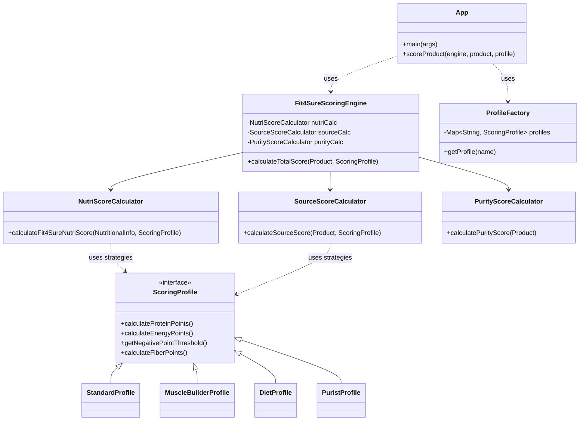
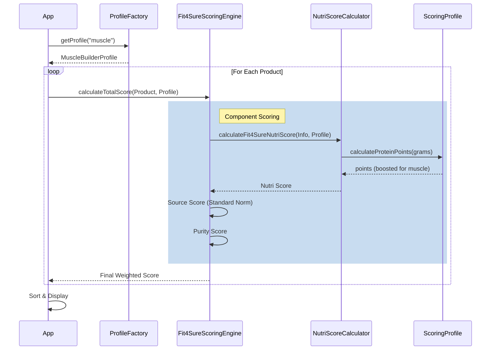

# Fit4Sure Scoring Engine Architecture

## High-Level Overview

The application follows a **Strategy Pattern** where the core scoring logic is decoupled from specific nutritional goals (Profiles). The `Fit4SureScoringEngine` orchestrates three sub-calculators, which in turn rely on the active `ScoringProfile` to normalize values and apply penalties.

## Component Diagram

## Data Flow

## Key Design Principles
1.  **Strategy Pattern**: Use of `ScoringProfile` allows swapping logic (e.g., how Protein is valued) without changing the core engine.
2.  **Factory Pattern**: `ProfileFactory` abstracts the creation and retrieval of these strategies.
3.  **Dependency Injection**: The `Fit4SureScoringEngine` receives its sub-calculators via constructor, making unit testing easier.
